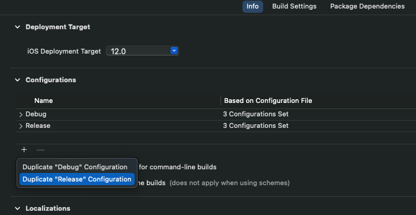

# React Native Code Push Using Custom Server Example

Since [Visual Studio App Center](https://appcenter.ms/apps) is about retire and we don't want to use EAS Update, So now we can create our own custom server using [@shm-open/code-push-server](https://github.com/shm-open/code-push-server) and [@shm-open/code-push-cli](https://github.com/shm-open/code-push-cli)

## Step 1 - Installing @shm-open/code-push-server

[Check complete installation here](https://github.com/shm-open/code-push-server?tab=readme-ov-file#how-to-install-code-push-server). Once you already installed and setup correctly, you can try access to http://localhost:3000.<br />
It should response sth like this:


> http://localhost:3000 is your code push server url. I recommend using IP Address due to testing real device </br>
> Default username: `admin` and password: `123456`

## Step 2 - Installing @shm-open/code-push-cli

### 1. Run this command:

```bash
npm install -g @shm-open/code-push-cli
```

### 2. Login Code-Push Account

```bash
code-push login http://localhost:3000
```

It will ask for token and open web browser. default account is username: `admin` and password: `123456`. </br>
After login success click obtain token then copy/past in prompt.

Run this command for verify login:

```bash
code-push whoami
```

### 3. Managing App

You need to add your app to Code Push Server first before deploy any update

command:

```bash
code-push app add <appName> <os> <platform>
```

You can add them separately.</br>
For example:

Android:

```bash
code-push app add Z-Android android react-native
```

iOS:

```bash
code-push app add Z-iOS ios react-native
```

### 4. Environment

Run this command display deployment keys:

Android:

```bash
code-push deployment ls Z-Android -k
```

iOS:

```bash
code-push deployment ls Z-iOS -k
```


### 5. Configuring Multi Environments on Android and iOS

Now we got keys!

Android:

More info [here](https://github.com/microsoft/react-native-code-push/blob/master/docs/multi-deployment-testing-android.md)

#### 1. Open the `android/app/build.gradle` file

add deployment keys

```
android {
    ...
    buildTypes {
        debug {
            ...
            // Note: CodePush updates should not be tested in Debug mode as they are overriden by the RN packager. However, because CodePush checks for updates in all modes, we must supply a key.
            resValue "string", "CodePushDeploymentKey", '""'
            ...
        }

        releaseStaging {
            ...
            // Add the following line if not already there
             // Note: It is a good idea to provide matchingFallbacks for the new buildType you create to prevent build issues
            matchingFallbacks = ['release']
            signingConfig signingConfigs.release
            minifyEnabled enableProguardInReleaseBuilds
            proguardFiles getDefaultProguardFile("proguard-android.txt"), "proguard-rules.pro"
            resValue "string", "CodePushDeploymentKey", '"daTRuP9yJhOaOnQfWvmQN9ey90AK4ksvOXqog"' //staging key
            ...
        }

        release {
            ...
            resValue "string", "CodePushDeploymentKey", '"o0udof2qeg1ki4kLvhNCuRU7N83z4ksvOXqog"' //production key
            signingConfig signingConfigs.release
            ...
        }
    }
    ...
}
```

> Retrieve these keys by running `code-push deployment ls -a Z-Android -k` from your terminal.

#### 2. Open the `strings.xml` file

Add Code Push Server Url.

```
<resources>
    <string name="app_name">Z</string>
    <string moduleConfig="true" name="CodePushServerUrl">http://localhost:3000/</string>
</resources>
```

#### 3. Allow `HTTP` in the `AndroidManifest.xml` file

```bash
<application android:usesCleartextTraffic="true">
</application>
```

iOS:

More info [here](https://github.com/microsoft/react-native-code-push/blob/master/docs/multi-deployment-testing-ios.md)

#### 1. Launch Xcode

Locate your project and ensure it’s selected, not one of your targets.

#### 2. Create a duplicate of the `Release` configuration

Switch to the Info tab then Click the `+` button in the Configurations section and Choose `Duplicate "Release" Configuration` from the dropdown menu.



Name the new configuration `Staging` or any preferred name.

#### 3. Add `User-Defined` Setting for `Multi_Deployment_Config`

Select the `Build Settings` tab then click button `+` and select `Add User-Defined Setting`


Name this new setting something like `Multi_Deployment_Config`. Go to the setting and add value `$(BUILD_DIR)/$(CONFIGURATION)$(EFFECTIVE_PLATFORM_NAME)` for Release. After that add value `$(BUILD_DIR)/Release$(EFFECTIVE_PLATFORM_NAME)` for Staging


#### 4. Add another `User-Defined` Setting for `CODEPUSH_KEY`


> Retrieve these keys by running `code-push deployment ls -a Z-iOS -k` from your terminal.

### 5. Update the `Info.plist` file

- Add value `$(CODEPUSH_KEY)` to entry `CodePushDeploymentKey`
- Add value `http://localhost:3000` to entry `CodePushServerUrl`


- Allow `HTTP` for request

```bash
<key>NSAppTransportSecurity</key>
<dict>
  <key>NSAllowsArbitraryLoads</key>
  <true/>
  <key>NSAllowsLocalNetworking</key>
  <true/>
</dict>
```

## Step 3 - Installing react-native-code-push

Before install, please check [support react-native platform here](https://github.com/microsoft/react-native-code-push?tab=readme-ov-file#supported-react-native-platforms)

```bash
npm install --save react-native-code-push
```

### configuring on ios

Complete setup guide is provided [here](https://github.com/microsoft/react-native-code-push/blob/master/docs/setup-ios.md)

#### 1. Run this command to install CocoaPods dependencies

```bash
cd ios && pod install && cd ..
```

#### 2. Open the `AppDelegate.mm` or `AppDelegate.m` file and import this statement

```
#import <CodePush/CodePush.h>
```

#### 3. Find the following line of code, which sets the source URL for bridge for production releases:

```
return [[NSBundle mainBundle] URLForResource:@"main" withExtension:@"jsbundle"];
```

#### 4. Replace it with this line:

```
return [CodePush bundleURL];
```

Your `sourceURLForBridge` method should look like this:

```
- (NSURL *)sourceURLForBridge:(RCTBridge *)bridge
{
  #if DEBUG
    return [[RCTBundleURLProvider sharedSettings] jsBundleURLForBundleRoot:@"index"];
  #else
    return [CodePush bundleURL];
  #endif
}
```

### Configuring on Android

Complete setup guide is provided [here](https://github.com/microsoft/react-native-code-push/blob/master/docs/setup-android.md)

#### 1. Open the `android/settings.gradle` file

Add these lines at the end of file

```
...
include ':app', ':react-native-code-push'
project(':react-native-code-push').projectDir = new File(rootProject.projectDir, '../node_modules react-native-code-push/android/app')
...
```

#### 2. Open the `android/app/build.gradle` file

Add these lines at the end of file

```
...
apply from: "../../node_modules/react-native-code-push/android/codepush.gradle"
```

#### 3. Open `MainApplication` file

For React Native 0.73 and above: update the `MainApplication.kt`

```
...
// 1. Import the plugin class.
import com.microsoft.codepush.react.CodePush

class MainApplication : Application(), ReactApplication {

override val reactNativeHost: ReactNativeHost =
    object : DefaultReactNativeHost(this) {
        ...

        // 2. Override the getJSBundleFile method in order to let
        // the CodePush runtime determine where to get the JS
        // bundle location from on each app start
        override fun getJSBundleFile(): String {
            return CodePush.getJSBundleFile()
        }
    };
}
```

For React Native 0.72 and below: update the `MainApplication.java`

```
...
// 1. Import the plugin class.
import com.microsoft.codepush.react.CodePush;

public class MainApplication extends Application implements ReactApplication {

    private final ReactNativeHost mReactNativeHost = new ReactNativeHost(this) {
        ...

        // 2. Override the getJSBundleFile method in order to let
        // the CodePush runtime determine where to get the JS
        // bundle location from on each app start
        @Override
        protected String getJSBundleFile() {
            return CodePush.getJSBundleFile();
        }
    };
}
```

## Step 4 - Configuring on App.tsx

Check more info [here](https://github.com/microsoft/react-native-code-push?tab=readme-ov-file#plugin-usage)

```
import React from 'react';
import {
  Platform,
  SafeAreaView,
  StyleSheet,
  Text,
  TouchableOpacity,
} from 'react-native';
import CodePush from 'react-native-code-push';

type DeploymentKeys = {
  ios: {[key: string]: string};
  android: {[key: string]: string};
};

const CODEPUSH_DEPLOYMENT_KEYS: DeploymentKeys = {
  android: {
    production: 'M20n1YNG0Fdetk79aOFCgnSjF1vE4ksvOXqog',
    staging: 'dEmN7BYofOsZJY8EmsZYNfTzOx7v4ksvOXqog',
  },
  ios: {
    production: 'lOVrQI4itIp1z0QMGMJVDvPIvRVq4ksvOXqog',
    staging: 'krxkHqnXRfKg9XO2K81fnVyHDOpQ4ksvOXqog',
  },
};

let codePushOptions = {checkFrequency: CodePush.CheckFrequency.ON_APP_START};

function App(): React.JSX.Element {
  const [status, setStatus] = React.useState('');
  const [process, setProcess] = React.useState('');

  const handleChangeEnvironment = (env: string) => {
    const {ios, android} = CODEPUSH_DEPLOYMENT_KEYS;
    const selectedKeys = Platform.OS === 'ios' ? ios : android;
    const deploymentKey = selectedKeys[env] || selectedKeys.production;
    CodePush.sync(
      {
        deploymentKey,
        updateDialog: true,
        installMode: CodePush.InstallMode.IMMEDIATE,
        mandatoryInstallMode: CodePush.InstallMode.IMMEDIATE,
      },
      status => {
        switch (status) {
          case CodePush.SyncStatus.DOWNLOADING_PACKAGE:
            setStatus('Downloading package.');
            break;
          case CodePush.SyncStatus.INSTALLING_UPDATE:
            setStatus('Installing update.');
            break;
          case CodePush.SyncStatus.UPDATE_INSTALLED:
            setStatus('Update installed. Restart not required.');
            break;
          case CodePush.SyncStatus.UP_TO_DATE:
            setStatus('The app is up to date.');
            break;
          case CodePush.SyncStatus.UPDATE_IGNORED:
            setStatus('Update cancelled by user.');
            break;
          case CodePush.SyncStatus.UNKNOWN_ERROR:
            setStatus('An unknown error occurred.');
            break;
        }
      },
      progress => {
        setProcess(
          `Received ${progress.receivedBytes} of ${progress.totalBytes} bytes.`,
        );
      },
    ).catch(e => setStatus(JSON.stringify(e)));
  };

  return (
    <SafeAreaView style={{flex: 1, padding: 20}}>
      <TouchableOpacity
        style={{padding: 10, backgroundColor: 'red'}}
        onPress={() => handleChangeEnvironment('production')}>
        <Text>Check for updates for production</Text>
      </TouchableOpacity>
      <TouchableOpacity
        style={{padding: 10, backgroundColor: 'blue', marginVertical: 20}}
        onPress={() => handleChangeEnvironment('staging')}>
        <Text>Check for updates for staging</Text>
      </TouchableOpacity>
      <Text>Production 12</Text>
      <Text>{status}</Text>
      <Text>{process}</Text>
    </SafeAreaView>
  );
}

export default CodePush(codePushOptions)(App);
```

## Step 5 - Testing and Release

### Bundling android and ios

In order to create the code-push update of the app, we bundle our application using the following command: [p.s: first, create a folder named `code-push` to store bundle files and assets]

Android

```bash
npx react-native bundle --platform android --dev false --entry-file index.js --bundle-output ./code-push/index.android.bundle --assets-dest ./code-push
```

iOS:

```bash
npx react-native bundle --platform ios --dev false --entry-file index.js --bundle-output ./code-push/main.jsbundle --assets-dest ./code-push
```


#### Build

> assume this already complete setup for build app. You have to build 2 app one is for staging and another one is for production.

For build on android device run:

```bash
cd android && ./gradlew clean

//staging
./gradlew assembleReleaseStaging
adb install app/build/outputs/apk/releaseStaging/app-releaseStaging.apk

// release
./gradlew assembleRelease
adb install app/build/outputs/apk/release/app-release.apk

cd ..
```

For build on ios device run:

you can build on Xcode or run command line

```bash
//staging
npx react-native run-ios --mode Staging

//release
npx react-native run-ios --mode Release
```

### Releasing Bundle to the Deployment Server

If you want to testing on stage first before pushing to the production, Make sure you're already [build releaseStaging and release](#build) separately. But if you don't want to test, just [deploy to production](#deploy-to-production) without [promoting](#rollout-promote-from-staging-to-production-to-specific-percentage-of-users) and [patching](#patch-to-all-users) to end users.

### Deploy to staging

Android:

```bash
code-push release-react Z-Android android --t 1.0.1 --dev false --d Staging --des "Staging" --m true
```

iOS:

```bash
code-push release-react Z-iOS ios --t 13.4 --dev false --d Staging --des "Staging" --m true
```

After testing and work as expected, you need to [promoting](#rollout-promote-from-staging-to-production-to-specific-percentage-of-users) and [patching](#patch-to-all-users) to end users or just [deploy to production](#deploy-to-production)

### Deploy to production.

Android:

```bash
code-push release-react Z-Android android --t 1.0.1 --dev false --d Production --des "Production" --m true
```

iOS:

```bash
code-push release-react Z-iOS ios --t 13.4 --dev false --d Production --des "Production" --m true
```

- --t: targetBinaryVersion
- --des: description
- --m: mandatory

### Rollout (Promote from staging to production) to specific percentage of users

```bash
code-push promote Z-Android Staging Production -r 100 --t 1.0.1 --des "Production 1.0.1" --m true
```

- -r: provides the rollout functionality and selects the percentage of users

### Patch to all users

```bash
code-push patch Z-Android Production -r 100 --t 1.0.1 --des "Production 1.0.1" --m true
```

### View log deployment

```bash
code-push deployment list Z-Android -k
```

- k: key

### View history deployment

```bash
code-push deployment history Z-Android Production
```

### Rollback

```bash
code-push rollback Z-Android Production --targetRelease v15
```

### Resource

https://github.com/shm-open/code-push-server

https://github.com/shm-open/code-push-cli

https://aexomir1.medium.com/configuring-react-native-code-push-using-custom-server-e40e87697a26

https://aexomir1.medium.com/handling-multi-deployment-environments-and-ab-testing-on-react-native-1d4e8e4b1e8e

https://github.com/microsoft/react-native-code-push
